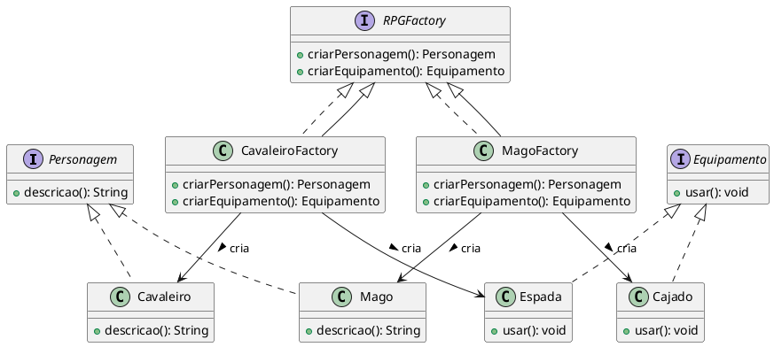

# Abstract Factory


## Brenda Gabriela Martinez Araújo (20221TADSSAJ0001) 

[@Brenda-Martinez](https://github.com/Brenda-Martinez)

<!-- @include: ../../../includes/seminario-1-Brenda-Martinez/README.md -->


## João Augusto

<figure>
  

</figure>

## Luís Miguel

`Interface Condutor`
```java
public interface Condutor {
    public void setNome(String nome);
    public void setIdade(String idade);
    public void setCarteira(String carteira);
}
```

`Classe Piloto que implementa a interface Condutor`
```java
public class Piloto implements Condutor {
    //Implementa métodos da interface
}
```

`Classe Motorista que implementa a interface Condutor`
```java
public class Motorista implements Condutor {
    //Implementa métodos da interface
}
```

`Interface Veiculo`
```java
public interface Veiculo {
    public void setNome(String nome);
    public void setMarca(String marca);
    public void setPlaca(String placa);
    public void setCondutor(Condutor condutor)
}
```

`Classe Carro que implementa a interface Veiculo`
```java
public class Carro implements Veiculo {
    //Implementa métodos da interface
}
```

`Classe Moto que implementa a interface Veiculo`
```java
public class Moto implements Veiculo {
    //Implementa métodos da interface
}
```

`Classe abstrata CriarVeiculoCorrida`
```java
public abstract class CriarVeiculoCorrida {
    public abstract criarCondutor(String nome, String idade, String carteira);
    public abstract criarVeiculo(String nome, String marca, String placa, Condutor condutor);
}
```

`Classe CriarMotoCross que estende a classe abstrata CriarVeiculoCorrida`
```java
public class CriarMotoCross extends CriarVeiculoCorrida {
    public criarCondutor(String nome, String idade, String carteira) {
        return new Piloto(nome, idade, carteira);
    }
    public criarVeiculo(String nome, String marca, String placa, String nomeCondutor, String idadeCondutor, String carteiraCondutor) {
        Piloto piloto = this.criarCondutor(nome, idade, carteira);
        return new Carro(nome, marca, placa, piloto);
    }
}
```

`Classe CriarStockCar que estende a classe abstrata CriarVeiculoCorrida`
```java
public class CriarStockCar extends CriarVeiculoCorrida {
    public criarCondutor(String nome, String idade, String carteira) {
        return new Motorista(nome, idade, carteira);
    }
    public criarVeiculo(String nome, String marca, String placa, String nomeCondutor, String idadeCondutor, String carteiraCondutor) {
        Motorista motorista = this.criarCondutor(nome, idade, carteira);
        return new Carro(nome, marca, placa, motorista);
    }
}
```

`Código cliente`
```java
public class Main {
    public static void main(String[] args) {
        CriarMotoCross abstractFactoryMotoCross = new CriarMotoCross;
        Moto honda = abstractFactoryMotoCross.criarVeiculo("CRF Cross", "Honda", "239JDS", "Luís", "20", "01234567890");
        Moto yamaha = abstractFactoryMotoCross.criarVeiculo("WR 250 F", "Yamaha", "234KSL", "Miguel", "20", "09876543210");
    }
}
```
