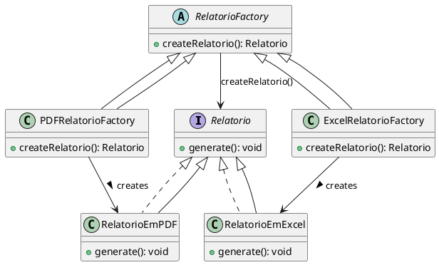

# Factory Method

## Árlei Nóbrega Oliveira (20221TADSSAJ0012)

[@Arlei10](https://github.com/Arlei10)

<!-- @include: ../../../includes/seminario-1-Arlei10/README.md -->

## José Victor Oliveira dos Santos (20212TADSSAJ0008)

[@zevictoros](https://github.com/zevictoros)

<!-- @include: ../../../includes/seminario-1-zevictoros/README.md -->

## WALLACE SELES NEVES


## Leandro

@[code](../../../includes/Leandro/factory_method/Recepcionista.java)

## João Augusto

<figure>



</figure>

## Luís Miguel

`Interface Lanche` 
```java
public interface Lanche {
    public void setMassa(String massa);
    public void setRecheio(String recheio);
    public void setMolho(String molho);
    public void setNome(String nome);
    public void setValor(Double valor);
}
```

`Classe Hamburguer` 
```java
public class Hamburguer implements Lanche {
    //Implementa métodos abstratos
}
```

`Classe Pizza` 
```java
public class Pizza implements Lanche {
    //Implementa métodos abstratos
}
```

`Classe Pastel` 
```java
public class Pastel implements Lanche {
    //Implementa métodos abstratos
}
```

`Classe abstrata FactoryLanche`
```java
public abstract class FactoryLanche {
    public abstract Lanche createLanche(String massa, String recheio, String molho, Double preco, String nome);
}
```

`Classe FactoryHamburguer extends FactoryLanche`
```java
public class FactoryHamburguer {
    public Hamburguer createLanche(String massa, String recheio, String molho, Double preco, String nome) {
        return new Hamburguer(massa, recheio, molho, preco, nome);
    }
}
```

`Classe FactoryPastel extends FactoryLanche`
```java
public class FactoryPastel {
    public Pastel createLanche(String massa, String recheio, String molho, Double preco, String nome) {
        return new Pastel(massa, recheio, molho, preco, nome);
    }
}
```

`Classe FactoryPizza extends FactoryLanche`
```java
public class FactoryPizza {
    public Pizza createLanche(String massa, String recheio, String molho, Double preco, String nome) {
        return new Pizza(massa, recheio, molho, preco, nome);
    }
}
```

`Código cliente`
```java
public class Main {
    public static void main(String[] args) {
        FactoryPizza factoryPizza = new FactoryPizza();
        Lanche pizza = factoryPizza.createLanche("Massa fina", "Mussarela, presunto e milho verde", "Molho branco", 49.90, "Pizza de ...");
        FactoryPastel factoryPastel = new FactoryPastel();
        Lanche pastel = factoryPastel.createLanche("Massa tradicional", "Frango com catupiry", "Molho de tomate", 18.90, "Pastel de ...");
        Lanche pastel2 = factoryPastel.createLanche("Massa tradicional", "Mussarela e presunto", "Molho de tomate", 18.90, "Pastel de ...");
    }
}
```
